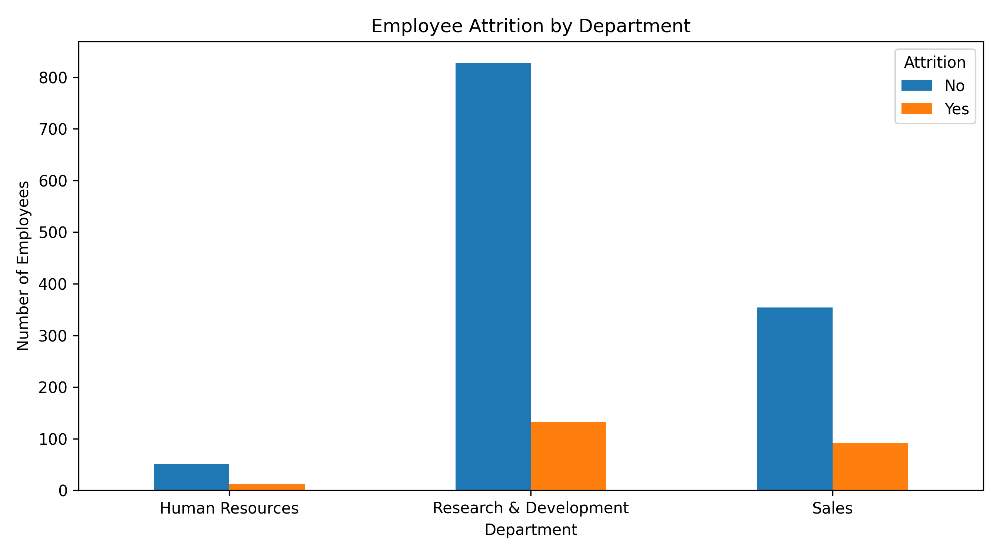
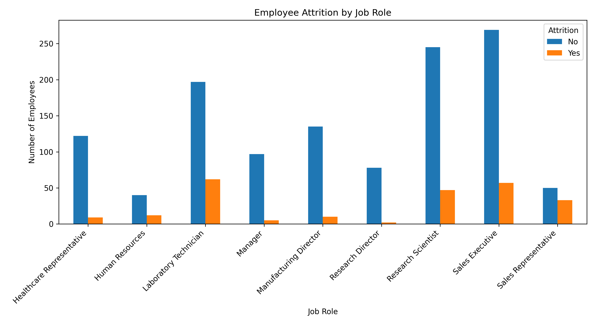
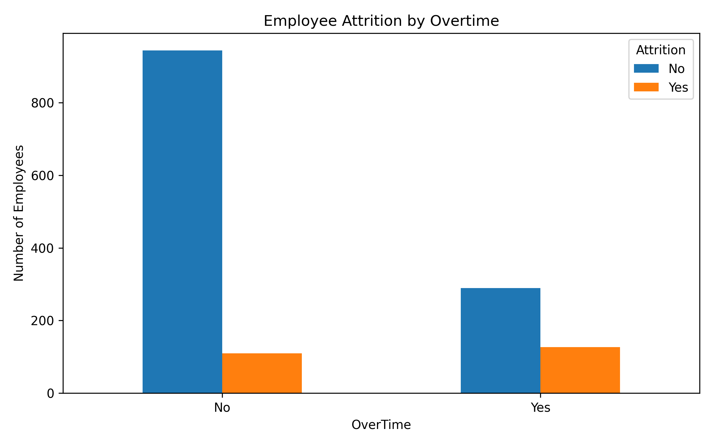
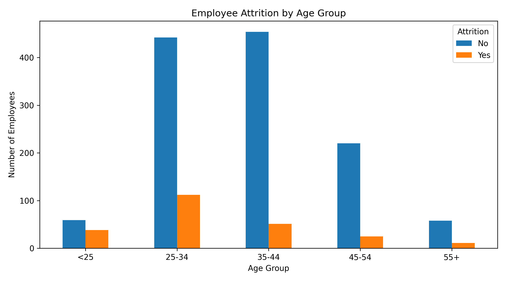
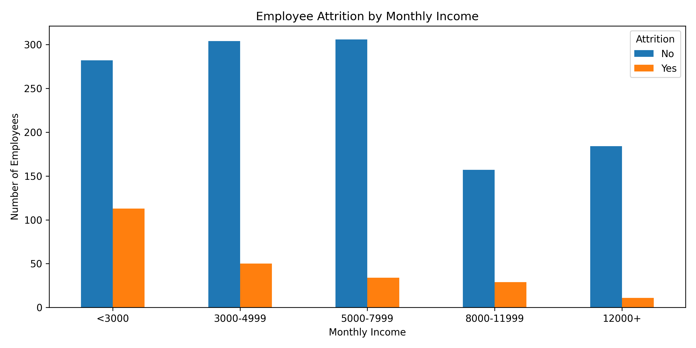
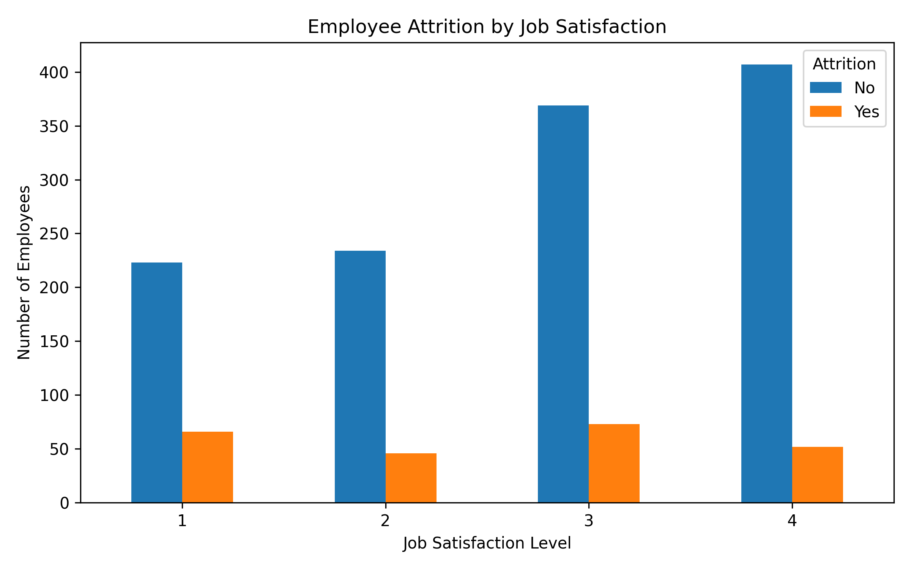
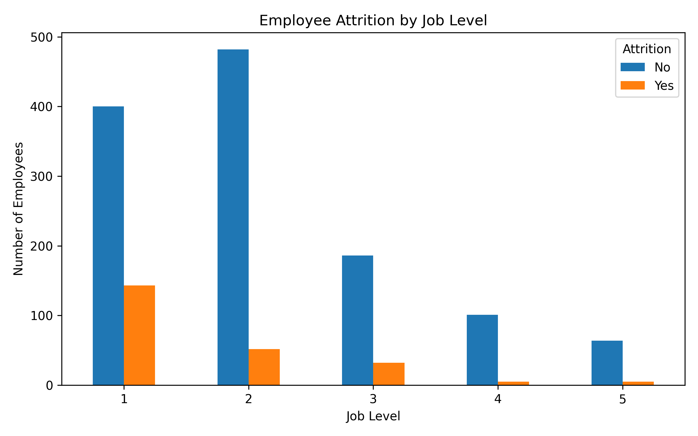
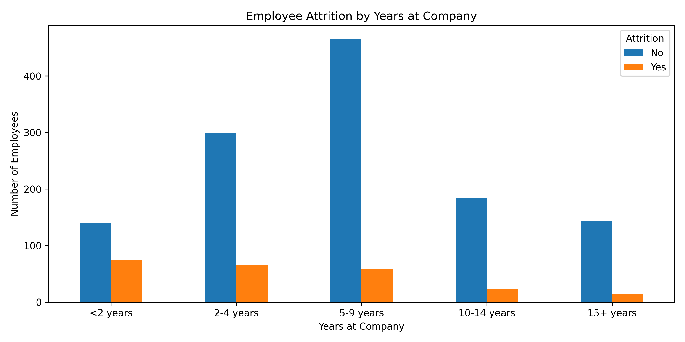
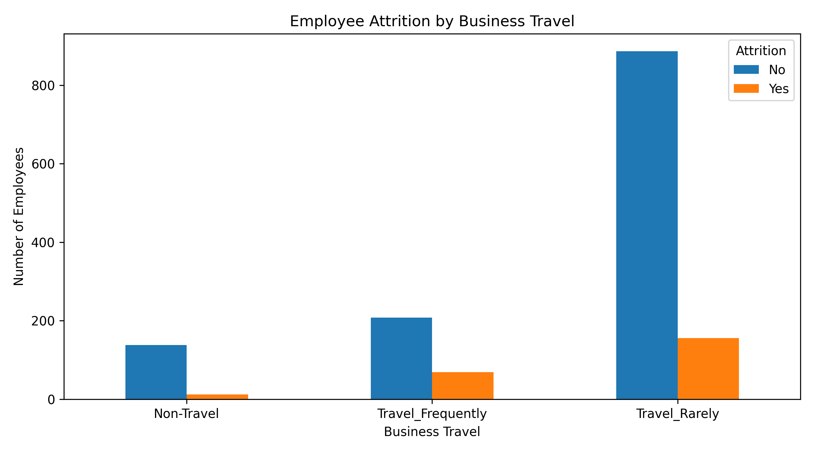
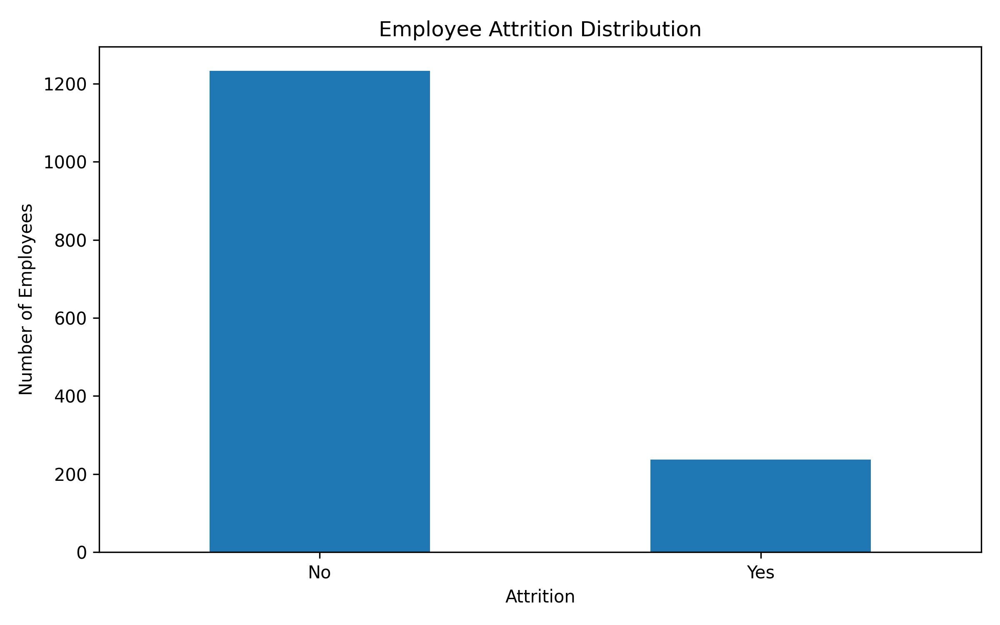

# HR Employee Attrition Analysis

Exploratory Data Analysis (EDA) and SQL analysis of employee attrition using **Python, Pandas, Matplotlib, and MySQL**.

This project demonstrates an end-to-end analytics workflow:

**Data Cleaning → Data Quality Checking → SQL Analysis → Exploratory Data Analysis → Visualization → Business Insights**

---

## Project Overview

This project analyzes employee attrition patterns across different employee characteristics. The analysis combines Python-based EDA with SQL-based business analysis.

The main dimensions analyzed are:

- Department
- Job Role
- Overtime
- Age Group
- Monthly Income
- Job Satisfaction
- Job Level
- Years at Company
- Business Travel

The project focuses on descriptive patterns and associations observed in the dataset rather than causal conclusions.

---

## Objectives

- Understand the overall employee attrition rate.
- Analyze attrition by department and job role.
- Compare attrition by overtime status.
- Analyze attrition across age and income groups.
- Analyze job satisfaction and job level patterns.
- Analyze attrition by years at company and business travel.
- Perform data quality checks.
- Create business-oriented visualizations.
- Use SQL to answer practical HR questions.
- Translate analytical results into business insights.

---

# Dataset

The dataset contains **1,470 employee records** and **35 original columns**.

After data cleaning, three constant columns were removed, resulting in **32 columns**.

| Metric | Value |
|---|---:|
| Total Employees | 1,470 |
| Original Columns | 35 |
| Constant Columns Removed | 3 |
| Final Columns | 32 |
| Attrition = No | 1,233 |
| Attrition = Yes | 237 |
| Overall Attrition Rate | 16.12% |
| Missing Values | 0 |
| Duplicate Rows | 0 |

## Data Preparation

The dataset was checked for dimensions, data types, unique values, missing values, duplicate rows, and constant columns.

The following constant columns were removed:

- `EmployeeCount`
- `Over18`
- `StandardHours`

The cleaned data was then loaded into MySQL/phpMyAdmin and Python using Pandas.

---

# Tools & Technologies

- **Python**
- **Pandas**
- **Matplotlib**
- **SQL / MySQL**
- **phpMyAdmin**
- **Google Colab**
- **GitHub**

---

# SQL Analysis

A total of **10 SQL analyses** were created.

| # | Analysis | Main Technique |
|---:|---|---|
| 01 | Overall Attrition | Aggregation and percentage |
| 02 | Attrition by Department | `GROUP BY` |
| 03 | Attrition by Job Role | `GROUP BY` |
| 04 | Attrition by Overtime | `GROUP BY` |
| 05 | Attrition by Age Group | `CASE WHEN` |
| 06 | Attrition by Monthly Income | `CASE WHEN` |
| 07 | Attrition by Job Satisfaction | `GROUP BY` |
| 08 | Attrition by Job Level | `GROUP BY` |
| 09 | Attrition by Years at Company | `CASE WHEN` |
| 10 | Attrition by Business Travel | `GROUP BY` |

SQL files are available in [`sql`](./sql).

## SQL Skills Demonstrated

- `SELECT`
- `WHERE`
- `GROUP BY`
- `ORDER BY`
- `CASE WHEN`
- `COUNT()`
- `SUM()`
- `ROUND()`
- Aggregate functions
- Percentage calculations
- Conditional grouping
- Window functions

---

# SQL Analysis Results

## 1. Overall Attrition

| Attrition | Total Employees | Percentage |
|---|---:|---:|
| No | 1,233 | 83.88% |
| Yes | 237 | 16.12% |
| **Total** | **1,470** | **100.00%** |

**Calculation:** `(237 / 1,470) × 100 = 16.12%`.

The dataset contains **237 employees with Attrition = Yes**, representing **16.12%** of all employees.

SQL: `sql/01_attrition_overall.sql`

---

## 2. Attrition by Department

| Department | Attrition | Total Employees | Attrition Percentage |
|---|---|---:|---:|
| Human Resources | No | 51 | 80.95% |
| Human Resources | Yes | 12 | 19.05% |
| Research & Development | No | 828 | 86.16% |
| Research & Development | Yes | 133 | 13.84% |
| Sales | No | 354 | 79.37% |
| Sales | Yes | 92 | 20.63% |

| Department | Total Employees | Employees Left | Attrition Rate |
|---|---:|---:|---:|
| Human Resources | 63 | 12 | 19.05% |
| Research & Development | 961 | 133 | 13.84% |
| Sales | 446 | 92 | 20.63% |



SQL: `sql/02_attrition_by_department.sql`

---

## 3. Attrition by Job Role

| Job Role | Total Employees | Employees Left | Attrition Rate |
|---|---:|---:|---:|
| Healthcare Representative | 131 | 9 | 6.87% |
| Human Resources | 52 | 12 | 23.08% |
| Laboratory Technician | 259 | 62 | 23.94% |
| Manager | 102 | 5 | 4.90% |
| Manufacturing Director | 145 | 10 | 6.90% |
| Research Director | 80 | 2 | 2.50% |
| Research Scientist | 292 | 47 | 16.10% |
| Sales Executive | 326 | 57 | 17.48% |
| Sales Representative | 83 | 33 | 39.76% |

The observed attrition rates vary substantially across job roles, from **2.50%** for Research Director to **39.76%** for Sales Representative.



SQL: `sql/03_attrition_by_job_role.sql`

---

## 4. Attrition by Overtime

| OverTime | Attrition | Total Employees | Attrition Percentage |
|---|---|---:|---:|
| No | No | 944 | 89.56% |
| No | Yes | 110 | 10.44% |
| Yes | No | 289 | 69.47% |
| Yes | Yes | 127 | 30.53% |

| Overtime | Total Employees | Employees Left | Attrition Rate |
|---|---:|---:|---:|
| No | 1,054 | 110 | 10.44% |
| Yes | 416 | 127 | 30.53% |



SQL: `sql/04_attrition_by_overtime.sql`

---

## 5. Attrition by Age Group

| Age Group | Total Employees | Employees Left | Attrition Rate |
|---|---:|---:|---:|
| <25 | 97 | 38 | 39.18% |
| 25-34 | 554 | 112 | 20.22% |
| 35-44 | 505 | 51 | 10.10% |
| 45-54 | 245 | 25 | 10.20% |
| 55+ | 69 | 11 | 15.94% |



SQL: `sql/05_attrition_by_age_group.sql`

---

## 6. Attrition by Monthly Income

| Income Group | Total Employees | Employees Left | Attrition Rate |
|---|---:|---:|---:|
| <3000 | 395 | 113 | 28.61% |
| 3000-4999 | 354 | 50 | 14.12% |
| 5000-7999 | 340 | 34 | 10.00% |
| 8000-11999 | 186 | 29 | 15.59% |
| 12000+ | 195 | 11 | 5.64% |



SQL: `sql/06_attrition_by_income.sql`

---

## 7. Attrition by Job Satisfaction

| Job Satisfaction | Total Employees | Employees Left | Attrition Rate |
|---:|---:|---:|
| 1 | 289 | 66 | 22.84% |
| 2 | 280 | 46 | 16.43% |
| 3 | 442 | 73 | 16.52% |
| 4 | 459 | 52 | 11.33% |



SQL: `sql/07_attrition_by_job_satisfaction.sql`

---

## 8. Attrition by Job Level

| Job Level | Total Employees | Employees Left | Attrition Rate |
|---:|---:|---:|
| 1 | 543 | 143 | 26.34% |
| 2 | 534 | 52 | 9.74% |
| 3 | 218 | 32 | 14.68% |
| 4 | 106 | 5 | 4.72% |
| 5 | 69 | 5 | 7.25% |



SQL: `sql/08_attrition_by_job_level.sql`

---

## 9. Attrition by Years at Company

| Tenure Group | Total Employees | Employees Left | Attrition Rate |
|---|---:|---:|---:|
| <2 years | 215 | 75 | 34.88% |
| 2-4 years | 365 | 66 | 18.08% |
| 5-9 years | 524 | 58 | 11.07% |
| 10-14 years | 208 | 24 | 11.54% |
| 15+ years | 158 | 14 | 8.86% |



SQL: `sql/09_attrition_by_tenure.sql`

---

## 10. Attrition by Business Travel

| Business Travel | Total Employees | Employees Left | Attrition Rate |
|---|---:|---:|---:|
| Non-Travel | 150 | 12 | 8.00% |
| Travel_Frequently | 277 | 69 | 24.91% |
| Travel_Rarely | 1,043 | 156 | 14.96% |



SQL: `sql/10_attrition_by_business_travel.sql`

---

# Exploratory Data Analysis

Python was used to validate the cleaned dataset, calculate grouped metrics, and create visualizations.

The EDA includes dataset inspection, data quality checks, attrition distribution, grouped analysis, percentage calculations, and visualization.

## Overall Attrition Distribution

- **1,470 total employees**
- **1,233 employees with Attrition = No**
- **237 employees with Attrition = Yes**
- **16.12% overall attrition rate**



## Department

| Department | Employees | Attrition = Yes | Attrition Rate |
|---|---:|---:|---:|
| Human Resources | 63 | 12 | 19.05% |
| Research & Development | 961 | 133 | 13.84% |
| Sales | 446 | 92 | 20.63% |


## Job Role

| Job Role | Employees | Attrition = Yes | Attrition Rate |
|---|---:|---:|---:|
| Healthcare Representative | 131 | 9 | 6.87% |
| Human Resources | 52 | 12 | 23.08% |
| Laboratory Technician | 259 | 62 | 23.94% |
| Manager | 102 | 5 | 4.90% |
| Manufacturing Director | 145 | 10 | 6.90% |
| Research Director | 80 | 2 | 2.50% |
| Research Scientist | 292 | 47 | 16.10% |
| Sales Executive | 326 | 57 | 17.48% |
| Sales Representative | 83 | 33 | 39.76% |


## Overtime

| Overtime | Employees | Attrition = Yes | Attrition Rate |
|---|---:|---:|---:|
| No | 1,054 | 110 | 10.44% |
| Yes | 416 | 127 | 30.53% |


## Age Group

| Age Group | Employees | Attrition = Yes | Attrition Rate |
|---|---:|---:|---:|
| <25 | 97 | 38 | 39.18% |
| 25-34 | 554 | 112 | 20.22% |
| 35-44 | 505 | 51 | 10.10% |
| 45-54 | 245 | 25 | 10.20% |
| 55+ | 69 | 11 | 15.94% |


## Monthly Income

| Income Group | Employees | Attrition = Yes | Attrition Rate |
|---|---:|---:|---:|
| <3000 | 395 | 113 | 28.61% |
| 3000-4999 | 354 | 50 | 14.12% |
| 5000-7999 | 340 | 34 | 10.00% |
| 8000-11999 | 186 | 29 | 15.59% |
| 12000+ | 195 | 11 | 5.64% |


## Job Satisfaction

| Job Satisfaction | Employees | Attrition = Yes | Attrition Rate |
|---:|---:|---:|---:|
| 1 | 289 | 66 | 22.84% |
| 2 | 280 | 46 | 16.43% |
| 3 | 442 | 73 | 16.52% |
| 4 | 459 | 52 | 11.33% |


## Job Level

| Job Level | Employees | Attrition = Yes | Attrition Rate |
|---:|---:|---:|---:|
| 1 | 543 | 143 | 26.34% |
| 2 | 534 | 52 | 9.74% |
| 3 | 218 | 32 | 14.68% |
| 4 | 106 | 5 | 4.72% |
| 5 | 69 | 5 | 7.25% |


## Years at Company

| Tenure Group | Employees | Attrition = Yes | Attrition Rate |
|---|---:|---:|---:|
| <2 years | 215 | 75 | 34.88% |
| 2-4 years | 365 | 66 | 18.08% |
| 5-9 years | 524 | 58 | 11.07% |
| 10-14 years | 208 | 24 | 11.54% |
| 15+ years | 158 | 14 | 8.86% |


## Business Travel

| Business Travel | Employees | Attrition = Yes | Attrition Rate |
|---|---:|---:|---:|
| Non-Travel | 150 | 12 | 8.00% |
| Travel_Frequently | 277 | 69 | 24.91% |
| Travel_Rarely | 1,043 | 156 | 14.96% |


---

# Key Findings

Based on the SQL and EDA results:

1. **Overall attrition:** 237 of 1,470 employees have Attrition = Yes, giving an overall rate of **16.12%**.
2. **Department:** observed attrition rates are 19.05% for Human Resources, 13.84% for Research & Development, and 20.63% for Sales.
3. **Job role:** observed attrition rates vary from **2.50%** for Research Director to **39.76%** for Sales Representative.
4. **Overtime:** the observed attrition rate is **30.53%** for employees with overtime and **10.44%** for employees without overtime.
5. **Age:** the `<25` group has an observed attrition rate of **39.18%**.
6. **Income:** the `<3000` group has an observed attrition rate of **28.61%**, while the `12000+` group has **5.64%**.
7. **Job satisfaction:** observed attrition ranges from **22.84%** at level 1 to **11.33%** at level 4.
8. **Job level:** observed attrition is **26.34%** at Level 1 and **4.72%** at Level 4.
9. **Tenure:** the `<2 years` group has an observed attrition rate of **34.88%**, while `15+ years` has **8.86%**.
10. **Business travel:** `Travel_Frequently` has an observed attrition rate of **24.91%**, compared with **8.00%** for `Non-Travel`.

These findings describe patterns in this dataset and should not be interpreted as proof of causation.

---

# Business Questions Answered

| Business Question | Analysis |
|---|---|
| What is the overall attrition rate? | Overall Attrition |
| How does attrition differ by department? | Department |
| How does attrition vary by job role? | Job Role |
| How does overtime relate to attrition distribution? | Overtime |
| How is attrition distributed across age groups? | Age Group |
| How does attrition vary across income groups? | Monthly Income |
| How does job satisfaction differ across attrition groups? | Job Satisfaction |
| How does attrition differ by job level? | Job Level |
| How does attrition vary by years at company? | Tenure |
| How does business travel differ across attrition groups? | Business Travel |

---

# Visualization Portfolio

The project contains **10 visualizations** created with Python and Matplotlib.

| # | Visualization | File |
|---:|---|---|
| 1 | Employee Attrition Distribution | `employee_attrition_distribution.png` |
| 2 | Attrition by Department | `attrition_by_department.png` |
| 3 | Attrition by Job Role | `attrition_by_job_role.png` |
| 4 | Attrition by Overtime | `attrition_by_overtime.png` |
| 5 | Attrition by Age Group | `attrition_by_age_group.png` |
| 6 | Attrition by Monthly Income | `attrition_by_income.png` |
| 7 | Attrition by Job Satisfaction | `attrition_by_job_satisfaction.png` |
| 8 | Attrition by Job Level | `attrition_by_job_level.png` |
| 9 | Attrition by Years at Company | `attrition_by_tenure.png` |
| 10 | Attrition by Business Travel | `attrition_by_business_travel.png` |

---

# Python EDA Notebook

The notebook contains:

- Dataset loading and inspection
- Data quality checks
- Missing-value analysis
- Duplicate checking
- Constant-column detection
- Data cleaning
- Attrition distribution
- Grouped analysis
- Percentage calculations
- Data visualization
- Analytical results

Notebook: [`notebooks/hr_employee_attrition.ipynb`](./notebooks/hr_employee_attrition.ipynb)

---

# Cleaned Dataset

[`data/hr_employee_attrition_cleaned.csv`](./data/hr_employee_attrition_cleaned.csv)

```text
Rows       : 1,470
Columns    : 32
Missing    : 0
Duplicates : 0
```

---

# Limitations

This project focuses on descriptive analytics and exploratory analysis.

The current analysis does not establish causal relationships, statistical significance, or predictive performance.

---

# Future Improvements

## Predictive Attrition Model

Potential extensions include Logistic Regression, Decision Tree, Random Forest, or Gradient Boosting.

## Statistical Testing

Statistical tests could be used to investigate whether observed group differences are statistically significant.

## Power BI Dashboard

The project can later be extended with an interactive dashboard containing attrition KPIs and filters for department, job role, overtime, age, income, satisfaction, job level, tenure, and business travel.

## Advanced Segmentation

Potential combinations include:

- Overtime + Job Satisfaction
- Job Level + Monthly Income
- Age Group + Years at Company
- Job Role + Overtime
- Business Travel + Job Satisfaction
- Income + Job Level

---

# Skills Demonstrated

## Data Analytics

- Data Cleaning
- Data Quality Checking
- Exploratory Data Analysis
- Descriptive Statistics
- Categorical Analysis
- Segmentation Analysis
- Percentage Analysis
- Business Question Development
- Business Insight Generation

## Python

- Python
- Pandas
- DataFrame manipulation
- `groupby()`
- Aggregation
- Data transformation
- Matplotlib
- Data visualization

## SQL

- `SELECT`
- `WHERE`
- `GROUP BY`
- `ORDER BY`
- `CASE WHEN`
- `COUNT()`
- `SUM()`
- `ROUND()`
- Aggregate functions
- Percentage calculations
- Window functions

## Business Analysis

- HR Analytics
- Employee Attrition Analysis
- Employee Turnover Analysis
- Workforce Segmentation
- Pattern Identification
- Business Insight Communication

---

# Project Deliverables

- [x] Cleaned HR dataset
- [x] Python EDA notebook
- [x] Data quality analysis
- [x] 10 SQL queries
- [x] SQL analysis results
- [x] 10 visualizations
- [x] Business insights
- [x] Analytical limitations
- [x] Future analysis opportunities
- [x] Project documentation

---

# Project Structure

```text
hr-employee-attrition-analysis/
│
├── data/
│   └── hr_employee_attrition_cleaned.csv
│
├── notebooks/
│   └── hr_employee_attrition.ipynb
│
├── sql/
│   ├── 01_attrition_overall.sql
│   ├── 02_attrition_by_department.sql
│   ├── 03_attrition_by_job_role.sql
│   ├── 04_attrition_by_overtime.sql
│   ├── 05_attrition_by_age_group.sql
│   ├── 06_attrition_by_income.sql
│   ├── 07_attrition_by_job_satisfaction.sql
│   ├── 08_attrition_by_job_level.sql
│   ├── 09_attrition_by_tenure.sql
│   └── 10_attrition_by_business_travel.sql
│
├── visualizations/
│   ├── employee_attrition_distribution.png
│   ├── attrition_by_department.png
│   ├── attrition_by_job_role.png
│   ├── attrition_by_overtime.png
│   ├── attrition_by_age_group.png
│   ├── attrition_by_income.png
│   ├── attrition_by_job_satisfaction.png
│   ├── attrition_by_job_level.png
│   ├── attrition_by_tenure.png
│   └── attrition_by_business_travel.png
│
└── README.md
```

---

# Conclusion

This project demonstrates an end-to-end **HR Employee Attrition Analysis** workflow using Python, Pandas, Matplotlib, SQL, and MySQL.

Starting with **1,470 employee records**, the project performs data quality checks, removes three constant columns, analyzes attrition across multiple HR dimensions, performs SQL-based business analysis, and creates visualizations to communicate the results.

The analysis covers overall attrition, department, job role, overtime, age group, monthly income, job satisfaction, job level, years at company, and business travel.

**Data Cleaning → Data Quality Checking → SQL Analysis → Python EDA → Visualization → Business Insights**

The project can be further extended with statistical testing, predictive attrition modeling, and an interactive Power BI dashboard.

---

# Author

**Rizky Fadhilah**

S1 Informatika — Universitas Janabadra

GitHub: [rizkyfadhilah-dev](https://github.com/rizkyfadhilah-dev)
